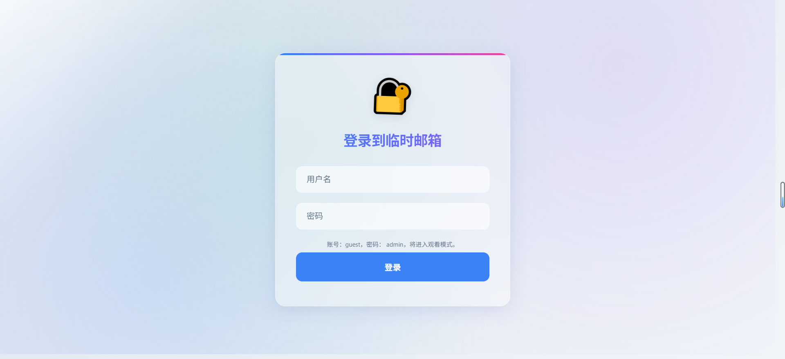
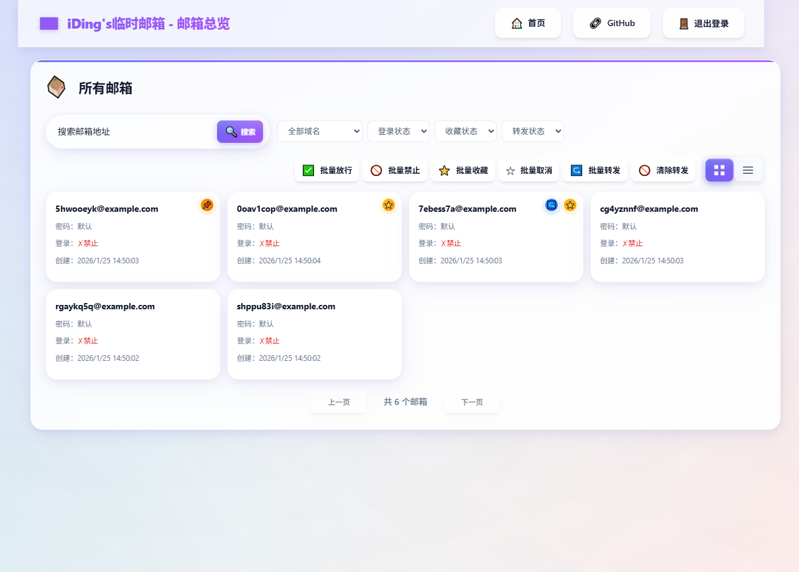
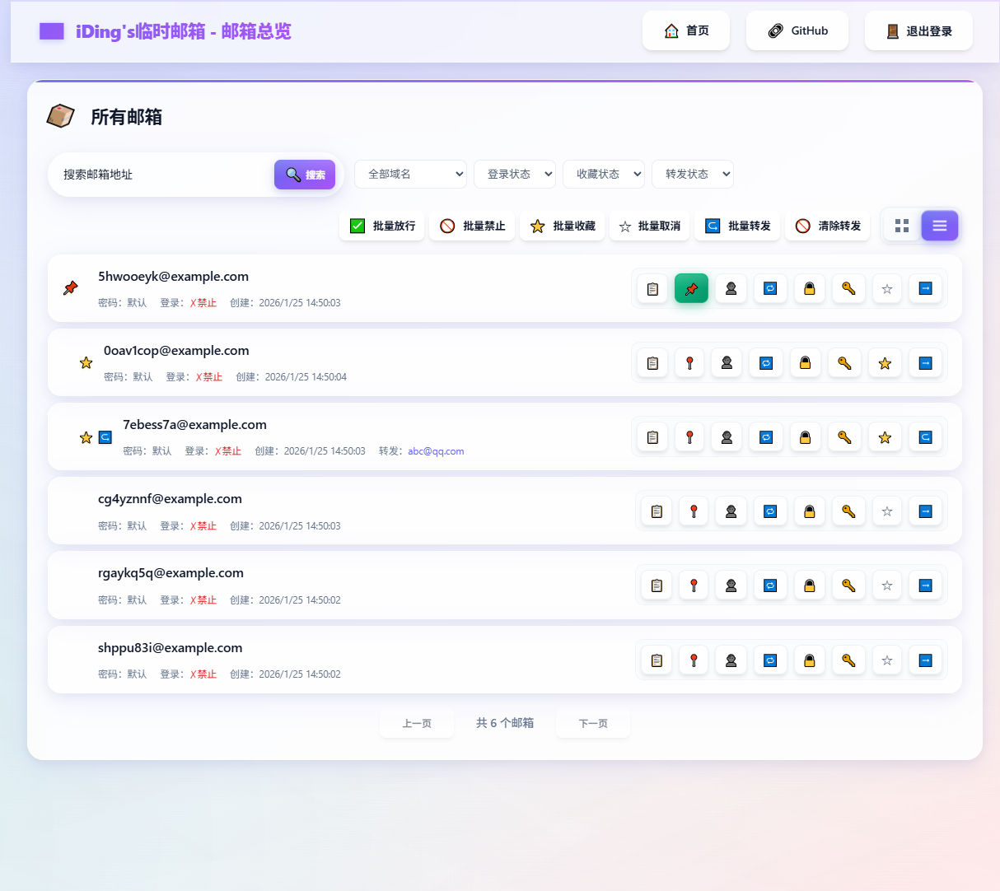
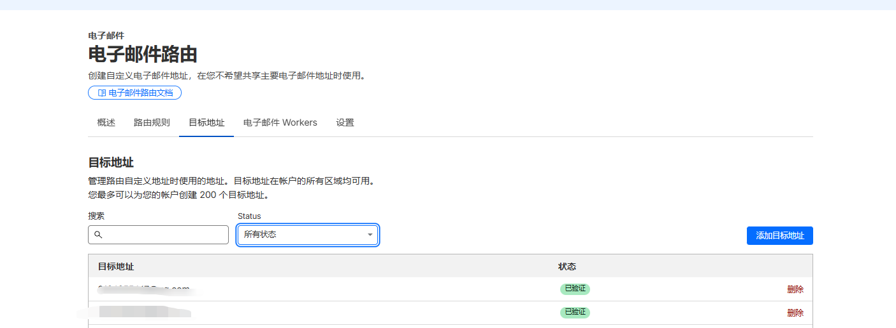

# Freemail - Temporary Email Service

[](https://deploy.workers.cloudflare.com/?url=https://github.com/nullbytef0x/Freemail-Revanced)

An **open-source temporary email service** built with Cloudflare Workers + D1 + R2.
It includes full features for email receiving, sending, forwarding, and user management.

**Current version: V4.8** - Added per-mailbox forwarding and favorites.

`Forward target addresses must be verified in Cloudflare Email Addresses before use.`

📖 **[One-click deployment guide](docs/yijianbushu.md)** | 📬 **[Resend sending setup](docs/resend.md)** | 📚 **[API docs](docs/api.md)**

## 📸 Project Preview
### Live demo: https://mailexhibit.dinging.top/

### Demo username: guest
### Demo password: admin
### Screenshots

#### Login


#### Home


### Mobile: Generation & History
<div style="display: flex; gap: 20px; justify-content: center; margin: 20px 0;">
  
  
</div>

### Single Mailbox Page


### All Mailboxes Preview



#### [Click for more screenshots](docs/zhanshi.md)

## Features

| Category | Features |
|------|------|
| 📧 **Mailbox Management** | Random temporary mailbox generation · Multi-domain support · Pin/Favorite · History · Search |
| 💌 **Mail Features** | Real-time receiving · Auto refresh · Smart verification code extraction · HTML/Plain text · Mail forwarding |
| ✉️ **Sending Support** | Resend API integration · Multi-domain API keys · Batch send · Scheduled send · Send history |
| 👥 **User Management** | Three-tier permission model · User/mailbox assignment · Mailbox SSO login · Login permission control |
| 🎨 **Modern UI** | Glassmorphism style · Responsive layout · Mobile support · List/Card views |
| ⚡ **Architecture** | Cloudflare Workers · D1 Database · R2 Storage · Email Routing |

> 💡 Self-service mailbox password change is disabled by default. To enable it, uncomment lines 77-80 in `mailbox.html`.

## Version History

<details>
<summary><strong>V4.8</strong> (Current) - Forwarding and Favorites</summary>

- Added filtering by forwarding/favorite status in mailbox management
- Added forwarding from a specific mailbox to a target email
- Added batch prefix forwarding via the `FORWARD_RULES` environment variable
</details>

<details>
<summary><strong>V4.5</strong> - Multi-domain Sending Configuration</summary>

- Supports different Resend API keys for different sender domains
- Supports key-value, JSON, and single-key formats
- Automatically selects API key based on sender domain
</details>

<details>
<summary><strong>V4.0</strong> - Mailbox Login and Global Management</summary>

- Added mailbox address SSO login
- Added global mailbox management and per-mailbox login restriction
- Added mailbox search, random name generation, and list/card view switching
</details>

<details>
<summary><strong>V3.x</strong> - User Management and Performance Optimization</summary>

- V3.5: Database query optimization, full EML storage in R2, mobile adaptation
- V3.0: Three-tier permission model, user management admin panel, frontend permission guards
</details>

<details>
<summary><strong>V1.x ~ V2.x</strong> - Core Features</summary>

- V2.0: Resend sending integration and mailbox pinning
- V1.0: Mailbox generation, email receiving, verification code extraction
</details>

## Deployment

### Quick Start

1. **One-click deploy**: Click the deploy button at the top and follow the [deployment guide](docs/yijianbushu.md)
2. **Configure Email Routing** (required for receiving): Domain → Email Routing → Catch-all → Bind to Worker
3. **Configure sending** (optional): Follow the [Resend setup guide](docs/resend.md)

> If you deploy via Git integration, configure environment variables manually in Workers → Settings → Variables.

### Environment Variables

| Variable | Description | Required |
|--------|------|------|
| TEMP_MAIL_DB | D1 database binding | Yes |
| MAIL_EML | R2 bucket binding | Yes |
| MAIL_DOMAIN | Mail domains, comma-separated | Yes |
| ADMIN_PASSWORD | Strict admin password | Yes |
| ADMIN_NAME | Strict admin username (default: `admin`) | No |
| JWT_TOKEN | JWT signing secret | Yes |
| RESEND_API_KEY | Resend API key(s), supports multi-domain config | No |
| FORWARD_RULES | Email forwarding rules | No |

<details>
<summary><strong>RESEND_API_KEY Formats</strong></summary>

```bash
# Single key (backward compatible)
RESEND_API_KEY="re_xxxxxxxxxxxxxxxxxxxxxxxx"

# Key-value format (recommended)
RESEND_API_KEY="domain1.com=re_key1,domain2.com=re_key2"

# JSON format
RESEND_API_KEY='{"domain1.com":"re_key1","domain2.com":"re_key2"}'
```

The system automatically chooses the correct API key based on the sender domain.
</details>

<details>
<summary><strong>FORWARD_RULES Formats</strong></summary>

Rules are matched by local-part prefix, and `*` is the fallback rule.

⚠️ **Important**: Target forwarding addresses must be verified in Cloudflare before they can be used:
1. Open Cloudflare Dashboard → Domain → Email → Email Routing
2. Go to the "Destination addresses" tab
3. Click "Add destination address" and enter your target email
4. Open the verification email in that inbox and confirm it



```bash
# Key-value format
FORWARD_RULES="vip=a@example.com,news=b@example.com,*=fallback@example.com"

# JSON format
FORWARD_RULES='[{"prefix":"vip","email":"a@example.com"},{"prefix":"*","email":"fallback@example.com"}]'

# Disable forwarding
FORWARD_RULES="" or "disabled" or "none"
```
</details>

## Troubleshooting

<details>
<summary><strong>Common Issues</strong></summary>

1. **Emails are not received**: Check Email Routing, MX records, and `MAIL_DOMAIN`
2. **Database connection errors**: Ensure the D1 binding name is `TEMP_MAIL_DB` and verify `database_id`
3. **Login issues**: Ensure `ADMIN_PASSWORD` and `JWT_TOKEN` are set, then clear browser cache
4. **UI rendering issues**: Check static asset paths and browser console errors
</details>

<details>
<summary><strong>Debug Tips</strong></summary>

```bash
# Local development
wrangler dev

# Real-time logs
wrangler tail

# Check database data
wrangler d1 execute TEMP_MAIL_DB --command "SELECT * FROM mailboxes LIMIT 10"
```
</details>

## Notes

- **Static asset cache**: After updates, run "Purge Everything" in Cloudflare and hard-refresh your browser
- **R2/D1 costs**: Free-tier limits apply; clean expired emails regularly
- **Security**: Always change default `ADMIN_PASSWORD` and `JWT_TOKEN` in production

## Star History

[](https://www.star-history.com/#idinging/freemail&Date)

## Contact

- WeChat: `iYear1213`

## Buy me a coffee

If this project helps you, your support is appreciated:

<p align="left">
  
  
</p>

## License

Apache-2.0 license
