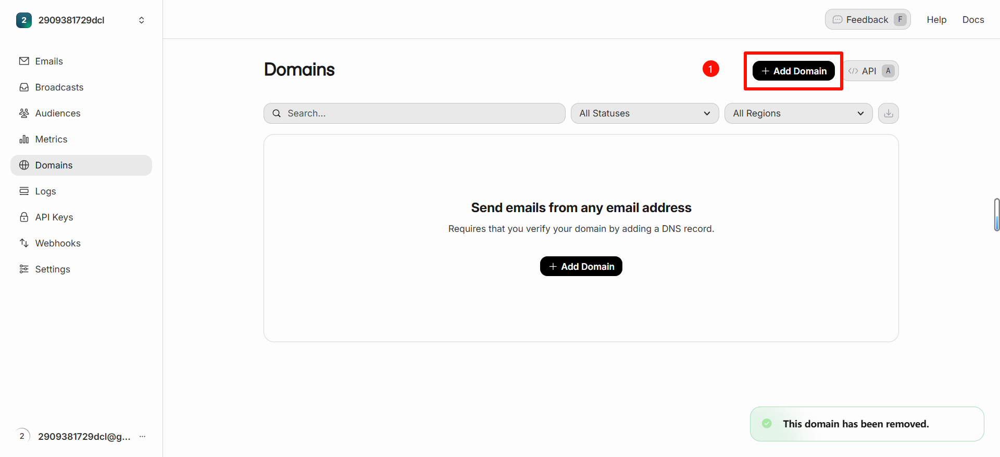
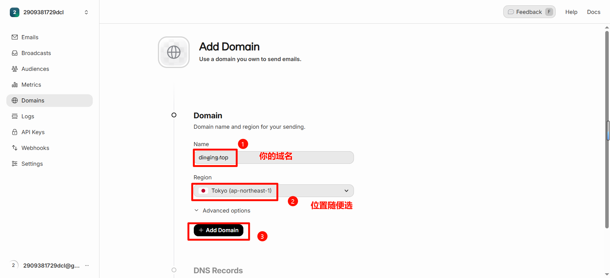
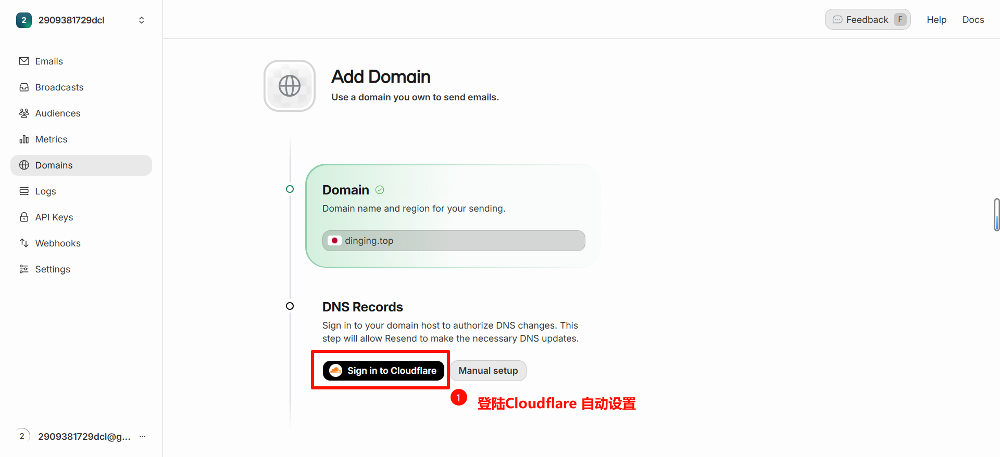
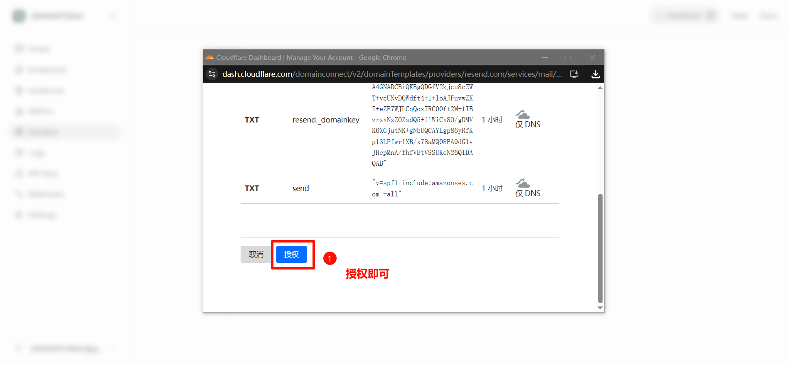
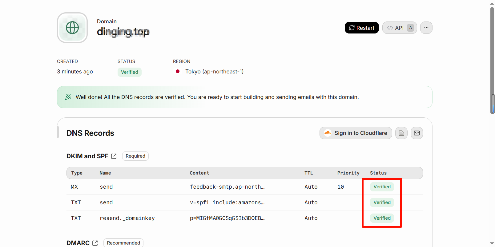
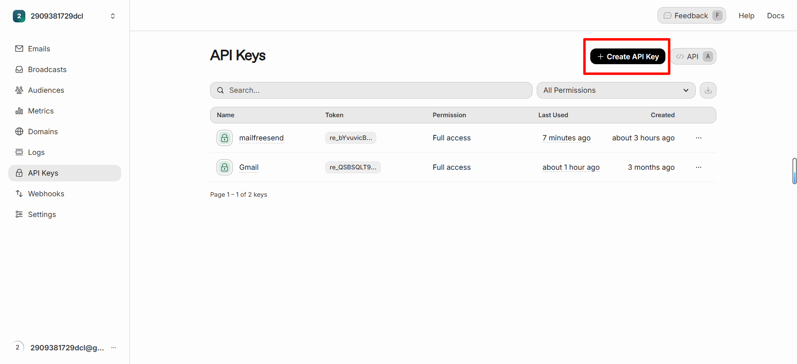
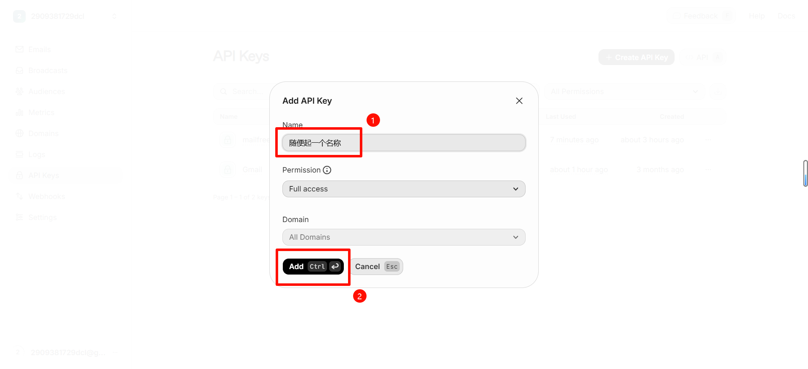
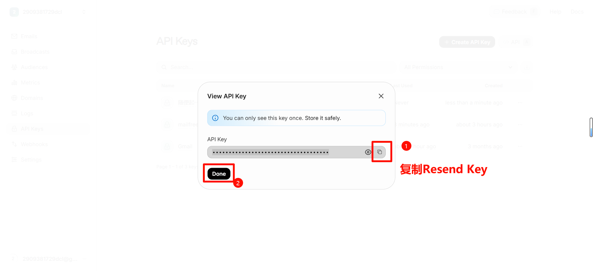

# Sending Email with Resend (API Key Setup Guide)

This project supports outbound email using the Resend API. This guide covers the full flow: creating keys, verifying domains, and configuring Cloudflare Workers.

> Environment variable fallback order in code: `RESEND_API_KEY` > `RESEND_TOKEN` > `RESEND`. Use `RESEND_API_KEY` whenever possible.

## 1. Add and verify your sending domain in Resend

- Sign in to Resend, go to Domains, and click Add Domain.
- Follow the wizard, add required DNS records, and wait for verification.

Reference screenshots:











After setup, ensure status is **Verified**. The sender address must use a verified domain, e.g. `no-reply@yourdomain.com`.

## 2. Create a Resend API key

- Open Resend → API Keys, then click Create API Key.
- Use read/write permissions (Emails: send/read/update) and store the key securely.

Reference screenshots:







## 3. Configure variables in Cloudflare Workers

This project runs on Cloudflare Workers. Set API keys as Secrets and domain config as regular variables.

Option A: Wrangler CLI

```bash
# Set Resend key as Secret
wrangler secret put RESEND_API_KEY
# Equivalent legacy names (not recommended): RESEND_TOKEN / RESEND

# Set normal vars in wrangler.toml [vars]
# Multiple domains can be comma/space separated
# Example: MAIL_DOMAIN="iding.asia, example.com"
```

Option B: Dashboard (common for Git-integrated deployments)
- Cloudflare Dashboard → Workers → your Worker → Settings → Variables
- Add `RESEND_API_KEY` under Secrets
- Add `MAIL_DOMAIN` under Variables (must match your verified Resend domains)

## 4. Deploy

```bash
# Local development
wrangler dev

# Production deploy
wrangler deploy
```

Make sure your `wrangler.toml` already binds D1 and static assets.

## 5. Use send-mail feature in frontend

- First generate/select a mailbox on the home page
- Click “Send Mail”, fill recipient/subject/content, then send
- Backend calls Resend API and stores send records; frontend can view records/details in Sent mailbox

Notes:
- The sender address is the currently selected mailbox (`xxx@yourdomain`). Domain must be verified in Resend.
- If you get `Resend API Key not configured`, `RESEND_API_KEY` is missing or not set as a Secret.

## 6. Common issues

- 403/Unauthorized: domain not verified, or From domain mismatches verified domain
- 429/rate limit: too many requests in short time; retry later or queue requests
- Chinese/HTML content: this project sends HTML to Resend and auto-generates plain text for compatibility

## 7. Related backend endpoints

- `POST /api/send` - send one email
- `GET /api/sent?from=xxx@domain` - list sent records
- `GET /api/sent/:id` - get sent record details
- `DELETE /api/sent/:id` - delete sent record

These endpoints are implemented in `src/apiHandlers.js` and `src/emailSender.js`, and use Resend REST APIs for send/query/cancel operations.
