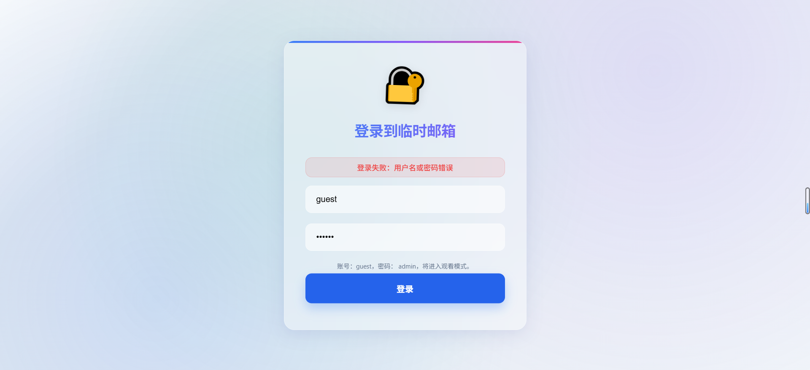
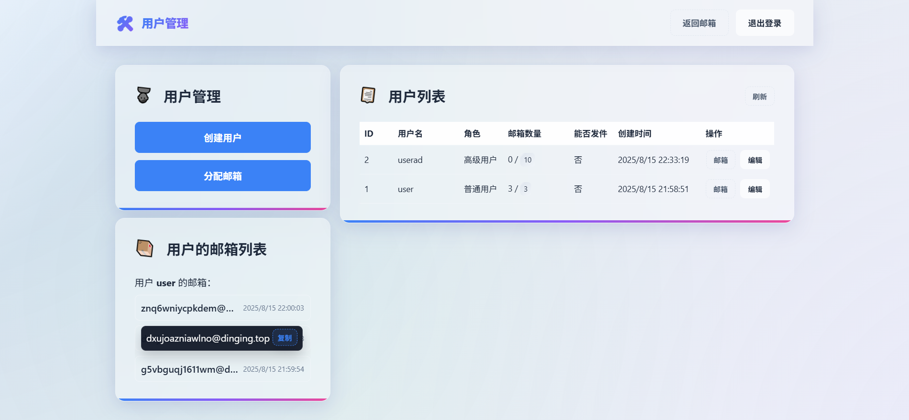
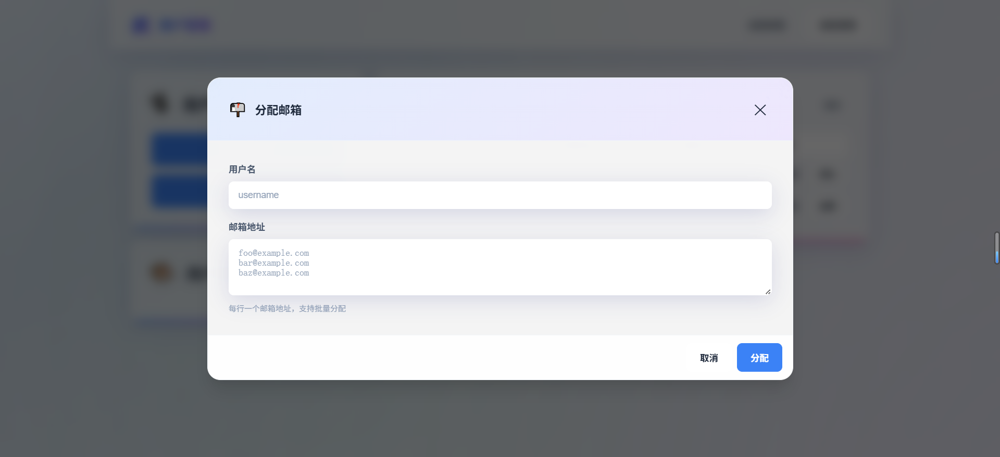
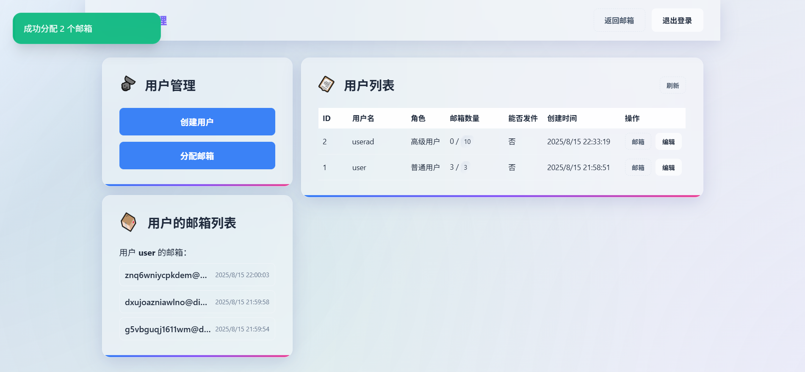
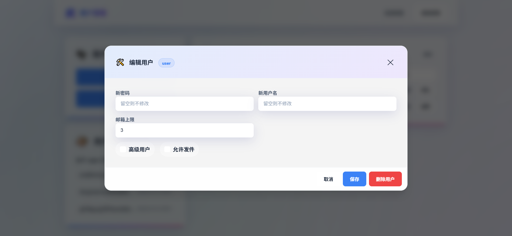
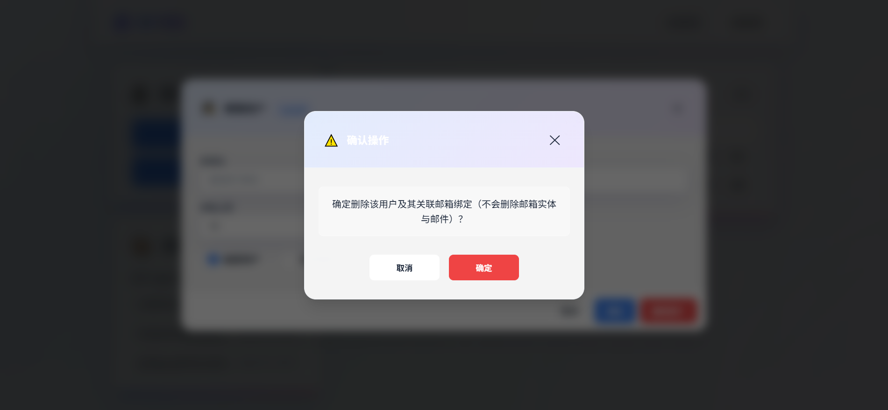
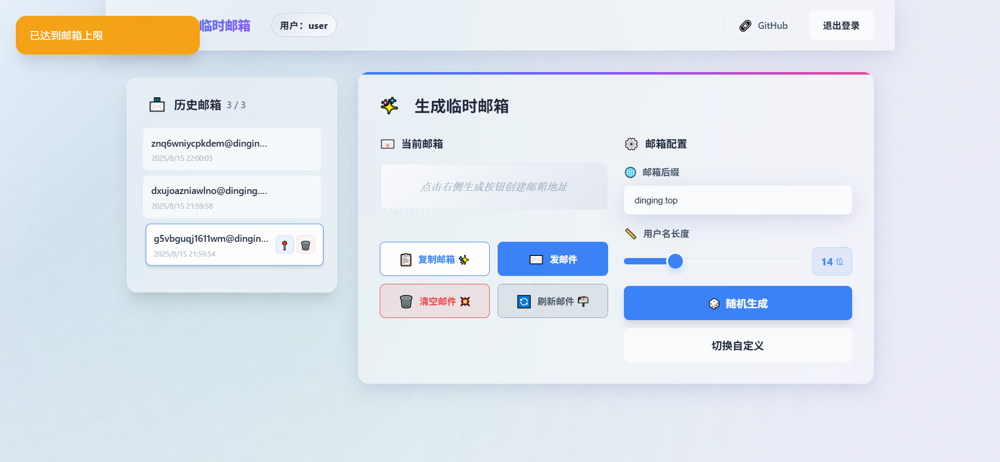

## V3 Release Notes

### Overview
V3 focuses on restructuring and upgrading the account system, admin panel, permissions, and UX. It introduces a user login system, a three-tier permission model, unified admin sub-pages, and improved error handling/demo mode.

### Key Updates

#### 1) Accounts and Permissions
- **Three permission tiers**:
  - **Strict Admin** (ENV: `ADMIN_NAME`, default `admin`): can access admin panel and all mailboxes; pinning is user-scoped and isolated; highest privileges.
  - **Advanced User** (DB `role=admin`): can only manage assigned mailboxes; default limit 20; sending enabled by default; no access to user-admin entry.
  - **Regular User** (DB `role=user`): lowest privilege; default limit 10; sending disabled by default; mailbox delete shows permission error.
- Login responses and JWT now include `role`, `userId`, `can_send`, and `mailbox_limit` for frontend UI/permission control.

#### 2) Admin Panel
- User list:
  - Action area simplified to two buttons: “Mailbox” and “Edit”
  - Added “Can Send” column
  - Optimized column widths to fully display created time
  - Moved “Refresh” button to top-right of user-list title bar
- Edit user (custom sub-page/modal):
  - Grid-form layout with current username in title
  - Role / can-send as switch-style checkboxes
  - Added manual save (“Update User”), password reset, username update
  - Sticky bottom action area; click outside to close (without saving)
  - Custom confirm dialog for delete action
- Mailbox assignment: supports multi-line batch assignment (one address per line)

#### 3) Homepage UX
- Shows quota next to mailbox history title: `used / total` (from `/api/user/quota`)
- Pinning (📍/📌):
  - Pin state changed to **user scope** (`user_mailboxes.is_pinned`)
  - Strict admins and regular/advanced users can pin mailboxes bound to themselves
  - Sorting: pinned first, then by time
- Delete permission: regular users receive clear toast message for forbidden delete
- Role badge: top bar shows regular/advanced/super-admin label and username
- Admin entry visibility: strict admin + guest demo mode only

#### 4) Demo/Mock Mode
- Uses built-in `MOCK_DOMAINS` to generate demo mailboxes (no real API domains)
- Initializes multiple demo users and multiple mailboxes per user for better history/pin demo

#### 5) Errors and Interaction
- On mailbox limit reached, `/api/generate` and `/api/create` return 400 and frontend shows warning (not success)
- Regular-user mailbox delete returns 403 with explicit permission message

### Related Configuration
- `ADMIN_NAME`: strict admin username (default `admin`)
- `ADMIN_PASSWORD`: strict admin password
- `MAIL_DOMAIN`: supports multiple domains (comma/space separated)

### Screenshots
> UI previews for the features above:

### Main Files Involved
- Frontend: `public/app.js`, `public/admin.html`, `public/admin.css`, `public/admin.js`, `public/templates/app.html`
- Backend: `src/server.js`, `src/apiHandlers.js`, `src/database.js`

### Notes
- On upgrade from older versions, required fields (such as `user_mailboxes.is_pinned`) are migrated on first run.
- If upgrade causes load/runtime errors, try resetting the D1 database.
