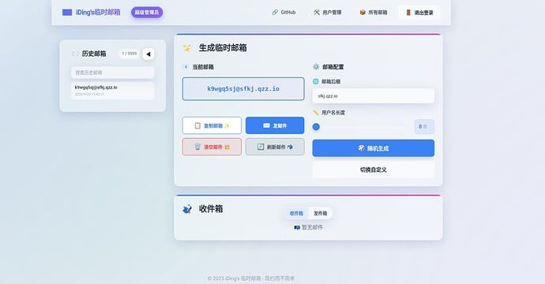
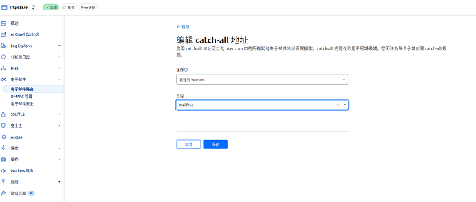

## One-Click Deployment Guide

#### 1. Click Deploy to Cloudflare

#### 2. After signing in, choose your region (Asia is recommended, but optional)
Do not change the D1 database name or R2 bucket name, or queries may fail.

#### 3. Click Create and Deploy, then wait for the clone/deploy process

#### 4. Continue project setup and bind the required environment variables

#### 5. After adding variables, click Deploy

Note: These three variables are required. Other variables (such as admin name and sending API key) are optional.

After deployment, open the Worker URL and sign in.

#### 6. The default admin username is admin

#### 7. Bind your domain email catch-all rule to this Worker
If you do not bind catch-all, incoming emails will not be received.

